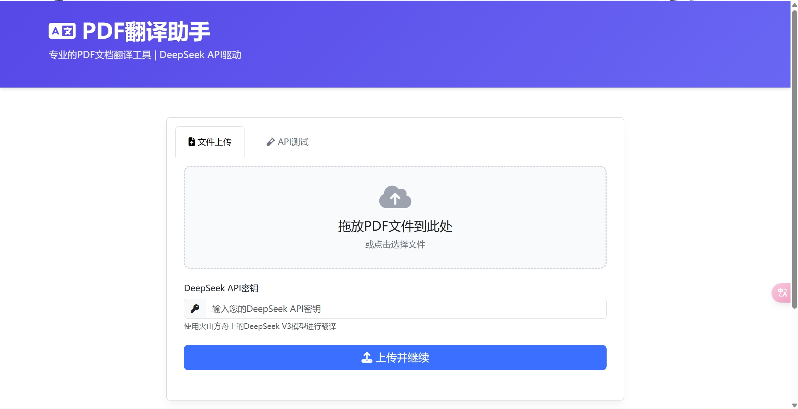
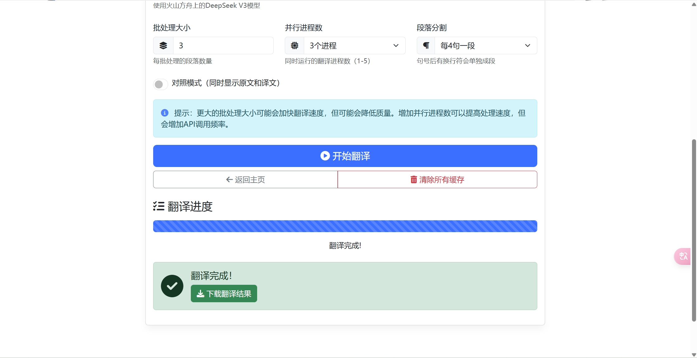

# PDF翻译助手

基于火山方舟的DeepSeek V3 API（运行速度比较稳定）的PDF文档翻译工具，将英文PDF文档自动翻译成中文，并提供美观的Web界面。

## 功能特点

- 支持PDF文件上传和翻译
- 原文对照模式，可同时显示原文和译文
- 异步并行翻译处理，提高翻译速度
- 实时进度显示和状态跟踪
- API测试功能，方便验证API密钥
- 可调整批处理大小和并行进程数
- 缓存管理功能
- 用户WebUI界面

## 安装使用

### 前置要求

- Python 3.7+
- [DeepSeek API申请地址](https://console.volcengine.com/ark)申请账号及API密钥

### 安装步骤

1. 克隆或下载本仓库
   ```
   git clone https://github.com/Chaoshcx/PDFTranslate.git
   ```
2. 安装依赖项：
   ```
   pip install -r requirements.txt
   ```
3. 运行应用：
   ```
   python app.py
   ```
4. 在浏览器中访问：`http://127.0.0.1:5000` 进入WebUI界面

### 使用方法

1. 上传PDF文件
2. 输入DeepSeek API密钥
3. 配置翻译参数（批处理大小、并行进程数等）
4. 开始翻译，等待处理完成
5. 下载翻译结果

## 参数说明

- **批处理大小**：每批处理的段落数量（1-10），越大处理速度越快，但可能降低质量
- **并行进程数**：同时运行的翻译进程数（1-5），可根据API限制和系统资源调整
- **段落分割**：每个段落包含的句子数（1-10），影响翻译的段落粒度



## 文件结构

- `app.py`：Flask Web应用主程序
- `#Book TranslateV1.py`：翻译核心功能模块
- `templates/`：HTML模板文件
- `static/`：静态资源文件（CSS/JS）
- `uploads/`：上传的PDF文件临时存储位置
- `outputs/`：翻译结果输出目录

## 注意事项

- 需要自行申请DeepSeek API密钥
- 翻译大型文档可能消耗较多API额度
- 请勿上传敏感或机密文档

## 技术栈

- 后端：Flask, Python
- 前端：Bootstrap 5, jQuery
- API：DeepSeek V3 API
- 其他：pdfplumber, python-docx

## 许可证

MIT License 
